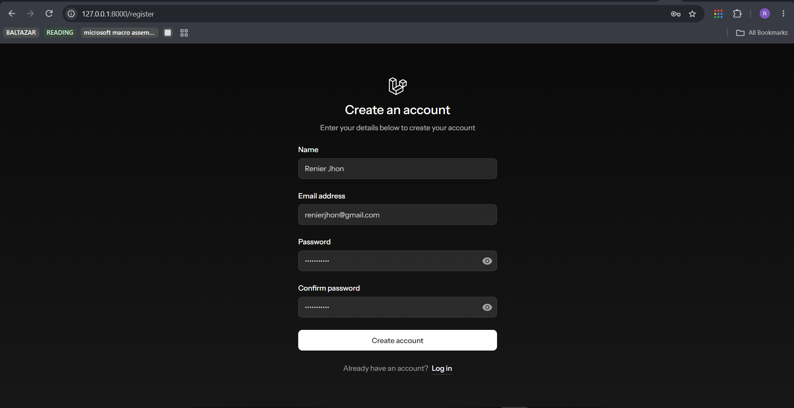
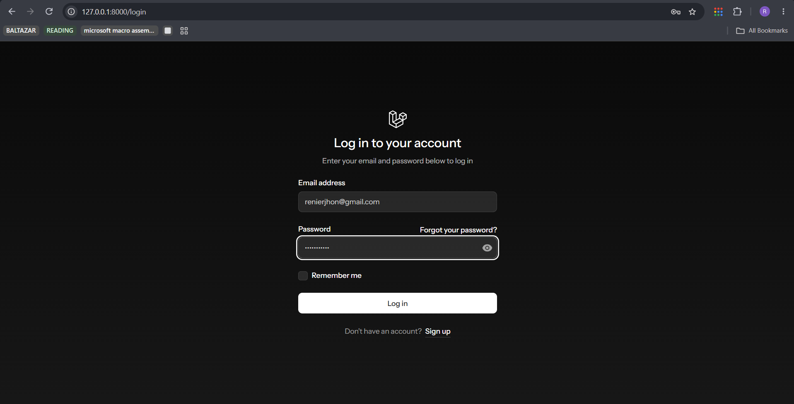
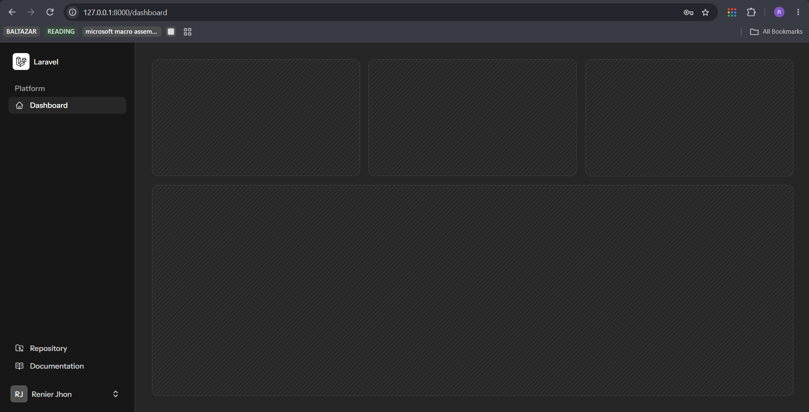
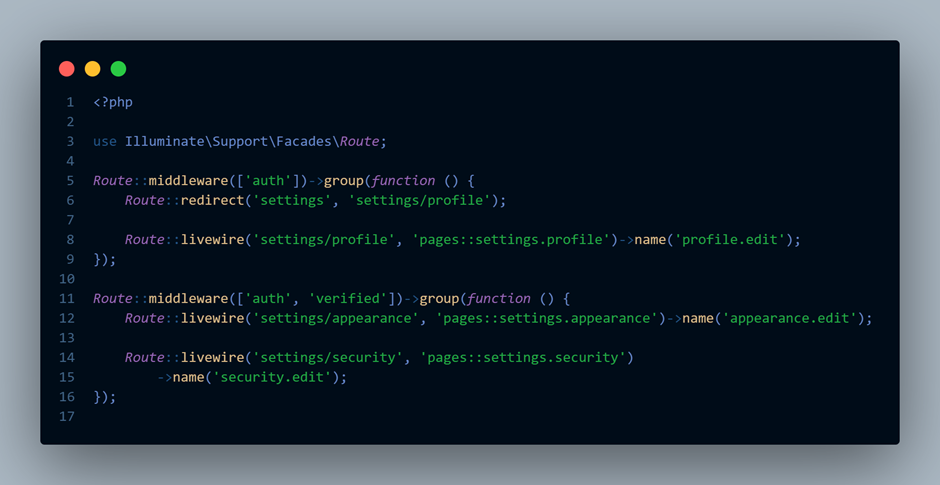

# Laravel Authentication Lab

### A Laravel-based authentication system built for Systems Integration and Architecture 1

A simple academic project focused on implementing **user registration, login, logout, authentication middleware, routing, and protected pages** using Laravel, Breeze, and Livewire.

 

---

## About

**Laravel Authentication Lab** is a simple authentication application created as part of **Systems Integration and Architecture 1**.

The project demonstrates how authentication works in Laravel through user registration, login, logout, and middleware-protected routes.

The application uses **Laravel Breeze** with **Livewire** and **Livewire Blaze** to provide the authentication interface and functionality.

---

## Features

* User Registration
* User Login
* User Logout
* Authentication Middleware
* Protected Dashboard
* Form Validation
* Session-based Authentication
* Password Hashing

---

## Screenshots

### Registration

### Login

### Dashboard

### Middleware-Protected Route

---

## Course Information

**Course:** Systems Integration and Architecture 1

**Laboratory:** Midterm Laboratory 1

**Topic:** Login, Registration, and Middleware Authentication in Laravel

**Academic Year:** 2026–2027

**Semester:** First Semester

---

## Developer

**Jhon Renier Tambogon**

BSIT Student
University of Eastern Pangasinan

Built for **Systems Integration and Architecture 1**.
